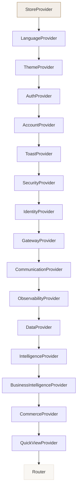

# ALAYA INSIDER — Architecture Overview

## Project Structure

```
alaya-insider-ecommerce-platform/
├── public/                        # Static assets (PWA)
│   ├── manifest.json              # Web App Manifest
│   └── service-worker.js          # Offline caching & push
├── scripts/
│   └── generate-icons.mjs         # PWA icon generator
├── src/
│   ├── App.tsx                    # Root: providers → router → routes
│   ├── main.tsx                   # Entry point + mobile platform init
│   ├── index.css                  # Tailwind v4 + design tokens
│   ├── utils/
│   │   └── cn.ts                  # Tailwind class merge utility
│   ├── lib/                       # ** Core business logic (40+ modules) **
│   ├── context/                   # ** React context providers (15) **
│   ├── components/                # ** Reusable UI components (60+) **
│   │   ├── admin/                 # Admin shell (layout, command palette, notifications)
│   │   ├── ai/                    # AI workspace components
│   │   ├── executive/             # Executive dashboard components
│   │   ├── home/                  # Homepage sections
│   │   ├── mobile/                # Mobile/PWA-specific components
│   │   ├── product/               # Product detail sub-components
│   │   └── ...                    # Shared components (Navbar, Footer, ProductCard, etc.)
│   └── pages/                     # ** Route-level pages (94) **
│       ├── admin/                 # Admin dashboard pages (69)
│       └── ...                    # Storefront pages (25)
├── .gitignore
├── ARCHITECTURE.md
├── README.md
├── index.html                     # HTML entry + PWA meta + SW registration
├── package.json
├── tsconfig.json
├── vite.config.ts
└── dist/
    └── index.html                 # Production build with JS/CSS chunks
```

## Module Map

### Library Modules (`src/lib/`)

| Module | Purpose |
|--------|---------|
| `types.ts` | Shared TypeScript types & interfaces |
| `utils.ts` | Formatting, currency, date, string helpers |
| `hooks.ts` | Custom React hooks (localStorage, media query, scroll, etc.) |
| `cn.ts` | Tailwind class merge |
| `ai.ts` | AI content generation (descriptions, FAQs, features) |
| `aiWorkspace.ts` | AI Workspace engine (agent registry, tasks, memory, decisions, observability, cost) |
| `analytics.ts` | Analytics event tracking & aggregation |
| `backup.ts` | System backup & restore |
| `businessIntelligence.ts` | Business metrics, forecasts, reports |
| `collections.ts` | Product collections |
| `commerce.ts` | Commerce operations |
| `commercePlatform.ts` | Platform commerce engine |
| `communications.ts` | Email, SMS, push notifications |
| `contentPlatform.ts` | CMS, editorial, content management |
| `csv.ts` | CSV import/export |
| `customerExperience.ts` | CX platform |
| `data.ts` | Data platform |
| `developer.ts` | Developer tools |
| `developerPlatform.ts` | Extension SDK, CLI, generators |
| `devops.ts` | CI/CD, environments, deployments, logging |
| `discovery.ts` | Product discovery & browsing |
| `editorialPlatform.ts` | Editorial workflow |
| `executiveIntelligence.ts` | Executive KPIs, reports, forecasting, digital twin, decision intelligence |
| `gateway.ts` | API gateway |
| `globalizationPlatform.ts` | Multi-language, multi-currency, compliance |
| `governancePlatform.ts` | Security, compliance, risk, audit |
| `identity.ts` | Authentication, SSO, MFA |
| `integrations.ts` | Third-party integrations |
| `intelligence.ts` | AI platform (models, agents, knowledge graph) |
| `jobs.ts` | Background job queue |
| `legal.ts` | Legal document management |
| `marketingPlatform.ts` | Campaign automation, analytics |
| `media.ts` | DAM (digital asset management) |
| `microservices.ts` | Microservice architecture |
| `mobilePlatform.ts` | PWA, device detection, offline queue, sync, voice, performance monitoring |
| `navigationPlatform.ts` | Mega menu & IA |
| `observability.ts` | Logs, traces, metrics, incidents |
| `operationsPlatform.ts` | Release mgmt, maintenance, DR |
| `orderStatus.ts` | Order tracking states |
| `recommendations.ts` | AI recommendation engine |
| `security.ts` | Encryption, session, audit, injection detection |
| `seed.ts` | Demo data seeding |
| `seo.ts` | SEO metadata, schema, sitemaps |
| `seoEngine.ts` | Programmatic SEO engine |
| `services.ts` | Service registry |
| `testingPlatform.ts` | QA & testing platform |
| `workflows.ts` | Workflow engine |
| `workflowsBpm.ts` | BPM platform |

### Context Architecture (`src/context/`)



### Context Architecture (text)

```
StoreProvider
├── LanguageProvider
│   └── ThemeProvider
│       └── AuthProvider
│           └── AccountProvider
│               └── ToastProvider
│                   └── SecurityProvider
│                       └── IdentityProvider
│                           └── GatewayProvider
│                               └── CommunicationProvider
│                                   └── ObservabilityProvider
│                                       └── DataProvider
│                                           └── IntelligenceProvider
│                                               └── BusinessIntelligenceProvider
│                                                   └── CommerceProvider
│                                                       └── QuickViewProvider
│                                                           └── Router
```

### Routing Architecture

- **Storefront** (25 routes): `Layout > Outlet` with shared Navbar/Footer/CartDrawer/SEO
- **Admin** (82 routes): `ProtectedRoute > AdminLayout > Outlet` with sidebar navigation
- **Auth boundary**: `/admin/login` is unprotected; all `/admin/*` routes require auth

### Design System

- **CSS Framework**: Tailwind CSS v4 with `@theme` design tokens
- **Theming**: Light/dark mode via CSS custom properties on `:root` / `.dark`
- **Typography**: Inter (sans) + Playfair Display (display/headings)
- **Icons**: Lucide React
- **Colors**: Canvas, surface, ink, muted, accent (gold), success, warning, info, danger
- **Components**: Button variants (`btn-primary`, `btn-outline`, etc.), cards, chips, badges, input fields, glass

### PWA & Offline

- **Service Worker**: Cache-first for assets, network-first for API, stale-while-revalidate for navigation
- **Manifest**: Full PWA manifest with shortcuts, screenshots, maskable icons
- **Offline Queue**: localStorage-based queue with retry logic and background sync
- **Sync Manager**: Cross-device sync with versioning and conflict resolution
- **Performance Monitoring**: LCP, CLS, INP, FCP, TTFB via PerformanceObserver

## Key Architecture Decisions

1. **Multi-file production build** via Vite — separate JS and CSS chunks for optimal caching
2. **Hash-based routing** (`HashRouter`) — no server-side URL handling needed
3. **Static mock data** — all data is seeded in-memory, no database required
4. **Context-based state** — 15 React contexts form a hierarchical state tree
5. **IndexedDB + localStorage** for persistent client-side storage
6. **Feature-rich admin** — 82 admin pages organized by domain (commerce, AI, marketing, executive, etc.)

## Build & Development

```bash
npm run dev       # Start Vite dev server
npm run build     # Production build → dist/ with JS/CSS chunks
npm run preview   # Preview production build
npx tsc --noEmit  # TypeScript type check
```
